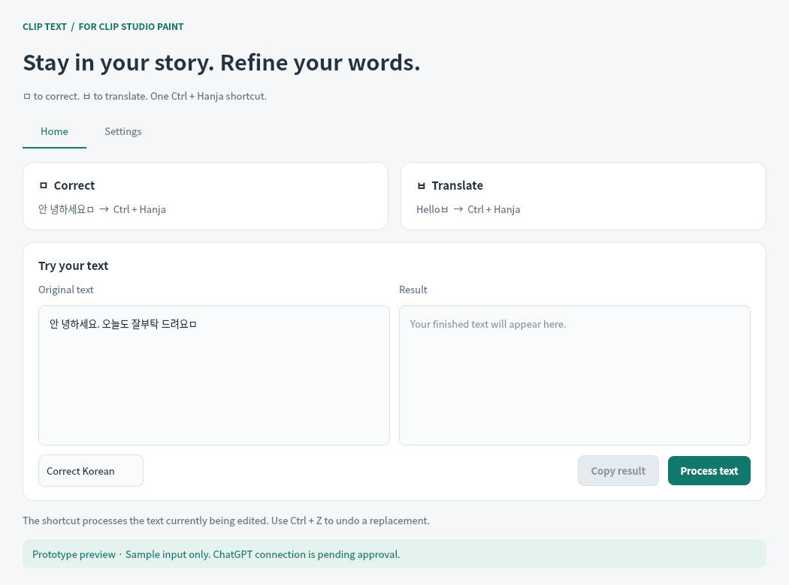
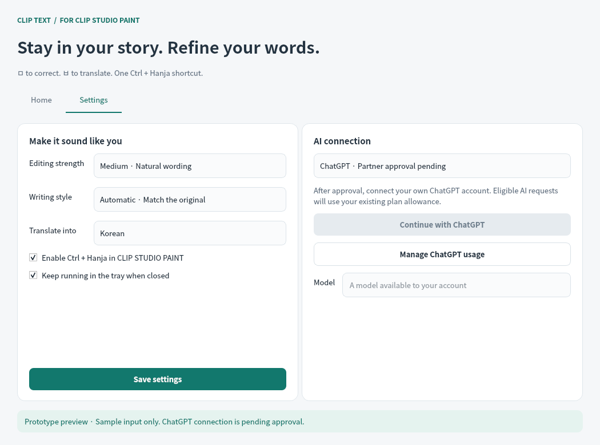

# Clip Text

**Korean text correction and translation for creators working in CLIP STUDIO PAINT.**

Clip Text (working name) is an early Windows 10/11 desktop companion for comic artists, illustrators, and writers. It is designed to help creators refine dialogue and translate text while staying in their editing workflow.

This repository presents the product and its current desktop prototype for commercial partner review.

## Prototype screens

These are screenshots captured from the running desktop prototype with its English interface. They were rendered on Linux for UI review. The sample text is illustrative; **no AI request was made for these screenshots**. Live ChatGPT integration and end-to-end Windows/CLIP STUDIO PAINT testing remain pending.

### Home — review and process text

The home screen provides direct text input, a result panel, and separate correction and translation modes. The result is intentionally empty while ChatGPT connection awaits approval.

### Settings — writing preferences and account connection

Editing strength, writing style, and target language are configurable. The **Continue with ChatGPT** button is disabled until commercial partner approval and integration are completed.

## Intended CLIP STUDIO PAINT workflow

While editing a text layer with the Text tool, append a command character and press **Ctrl + Hanja**, using the Hanja key on a Korean keyboard.

| Input example | Shortcut | Requested action |
| --- | --- | --- |
| `안 녕하세요ㅁ` | Ctrl + Hanja | Correct Korean spelling, spacing, and wording |
| `Helloㅂ` | Ctrl + Hanja | Translate into the selected language |

`ㅁ` means correction and `ㅂ` means translation. Only the final command character is removed. The planned workflow processes the text currently being edited and replaces it after a successful request. The implemented replacement controller cancels if the source text or editing focus changes; this protection has been tested with simulated clipboard workflows.

## Features in the prototype

- Home and settings screens with Korean and English UI labels.
- Editing strength: low, medium, high, or automatic.
- Writing style: spoken, written, or automatic.
- Translation targets: Korean, English, Japanese, Chinese, Spanish, and French.
- Background processing, a result review panel, and system tray controls.
- Command parsing and safeguards against replacing text after the user changes the document or editing focus.

No local language model is included.

## Development status

| Area | Status |
| --- | --- |
| Desktop UI and English prototype screenshots | Implemented and rendered from the running app |
| Commands, settings, simulated replacement, and UI behavior | Automated tests pass |
| Windows hotkey and clipboard implementation | Implemented; native integration validation pending |
| Actual Korean IME and CLIP STUDIO PAINT workflow | End-to-end testing pending |
| Sign in with ChatGPT and ChatGPT plan usage | Commercial partner approval and implementation pending |
| Live model quality and supported model selection | Validation pending |
| Commercial release | Planned; not yet available |

An optional OpenAI API adapter exists for development testing. It is separate from the proposed ChatGPT plan integration, and API billing is separate from a ChatGPT subscription.

## Sign in with ChatGPT proposal

We are seeking **Sign in with ChatGPT and ChatGPT plan use for AI requests** for a commercial desktop product. After approval, each user would authenticate their own account and explicitly authorize eligible requests to use their existing ChatGPT plan allowance. The application does not need access to ChatGPT conversation history or memories.

We will use the approved commercial integration and client ID. ChatGPT connection is not enabled in this prototype. See the [product and partnership brief](docs/product-overview.md) for the proposed integration and commercial plan.

## Commercial plan

Clip Text is intended to be a paid desktop application for individual creators. Pricing, the licensing model, and the launch date have not yet been finalized. The application fee would be separate from the user's ChatGPT subscription.

This is an independent product in development. CLIP STUDIO PAINT is a product of CELSYS; no affiliation or partnership approval is implied.
